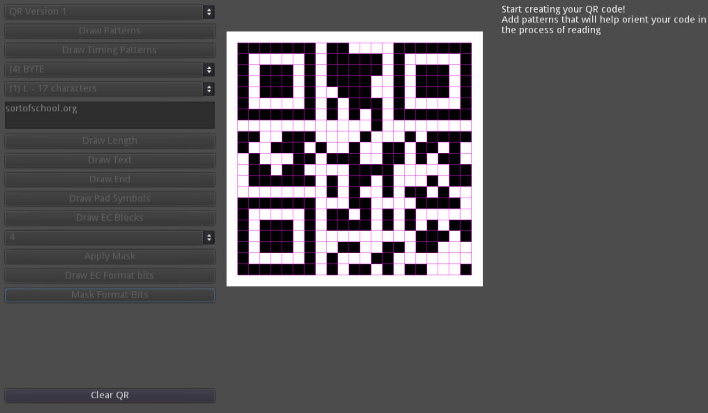

# QR Code Step-by-Step Generator

This program serves as a learning tool and demonstration platform for understanding the step-by-step generation of QR codes. It provides insights into the workings of QR codes and lets users visualize the entire process.

## Accessing the Program

1. **Executable Version**: If you wish to download the `.exe`, navigate to the `_export` folder in this repository.
2. **Web Version**: For a web-based experience, you can run the program directly in your browser from [my official website](https://sortofschool.org/tools/qr/qr).

## Important Notes
- Ensure to follow the process step-by-step. Skipping generation steps may lead to unexpected errors and an incorrect representation of the QR code.
- Built with [Godot v3.5.1](https://godotengine.org/)
- Supports only Version 1 of QR codes (21x21 matrix size)
- Currently operates only in byte-mode

## Attribution

This program was inspired by and built upon foundational knowledge from various sources. I like to extend my heartfelt appreciation to the following articles and their authors:

- **"An Introductory Tutorial For Encoding QR Codes"** by Zavier Henry
  - [Link to Article 1](https://zavier-henry.medium.com/an-introductory-walkthrough-for-encoding-qr-codes-5a33e1e882b5)
  - Description: An introductory piece that lays down the basic principles behind QR codes, making it easier for beginners to grasp the foundational concepts.
- **"QR Code Tutorial"** by Thonky
  - [Link to Article 2](https://www.thonky.com/qr-code-tutorial/introduction)
  - Description: A highly technical and exhaustive exploration of QR code generation. While intricate, it offers a deep dive into every nuance of the QR code system.

- **"Reed-Solomon Error Correcting Codes from the Bottom Up"** by tomverbeure
  - [Link to Article 3](https://tomverbeure.github.io/2022/08/07/Reed-Solomon.html)
  - Description: This article focuses on the Reed-Solomon Error Correcting Codes employed in QR generation, presenting the concept without delving into the complexities of Galois fields.
---

Feel free to contribute, raise issues, and provide feedback. Every contribution is appreciated!

